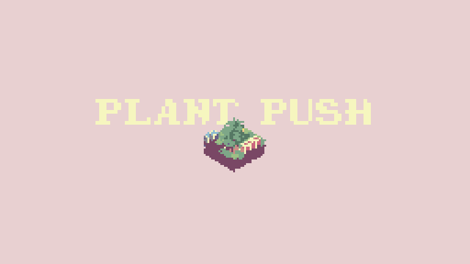

# Plant Push



<p>
    
    
</p>

## Installation
The game is built with tic80
https://github.com/nesbox/TIC-80/


I reccomend you download and install tic80 for your platform (make sure it's on your $PATH)
Then just clone this repo and run this command to run the game.
```
tic80 --fs . --cmd 'load game.tic & import code game.lua & run' --keepcmd --skip
```

## How it started

This project began in 2021 when I was exploring tic80 and found [this](https://tic80.com/play?cart=1229) cart.
I thougt it would be cool to move the camera view around with the mouse so I implemented that feature.
Then I started creating a player charachter.
I gradually added features without much idea of how the final concept was going to look like.
Moveable player character,
3D coordinate system overlaid on TIC-80's tilemap,
Basic scripting system for block-player interactions.